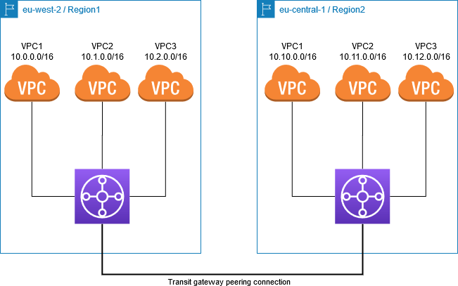
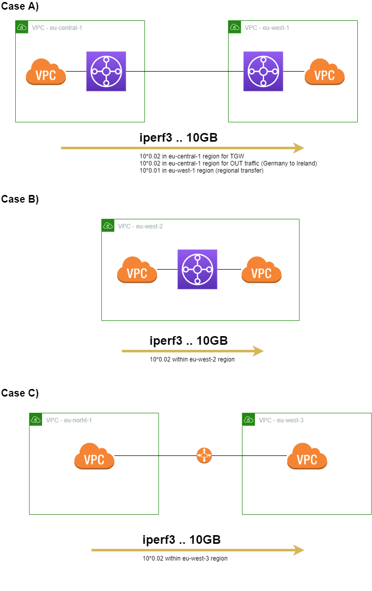

_This is a work in progress_

# Example of Inter-region transition gateway peering

This repository is just a time capsule of my tryings to catch information about building transit gateway onto one place. The goal of my trying is to deliver an inter-region communication among VPCs. Ideally, among multiple clouds. Thesedays, the main cloud I am using is Amazon AWS, but I would like to extend my knowledge to other clouds as well.


All the tryies will be implemented using [Terraform](https://www.terraform.io/) while the motivation for Terraform is to keep the implementation cloud agnostic as much as possible.

# Amazon AWS - Transit gateway

Amazon AWS delivers [Transit gateway](https://aws.amazon.com/transit-gateway/) as an in-house building block. In the past there has been a plethora implementations and even AWS white papers on these 3rd party components. All these reference implementations were implementing the control plane while data plane was AWS VPN, i.e., pair of IPsec tunnels. I am not covering more of these legacy architecture, as the goal of this document is to review AWS branded technology, and propose an architecture based on AWS components. Additionall, I wont try to implement any final solution. I only plan to show foundation moving parts and show how they work. I believe the glue code can implement anybodu using cloud specific languages, e.g., AWS Lambda.

AWS TGW allows connecting a number of VPCs within the same regio, so that the communication is controlled by routing tables, security groups, and network access control lists. VPCs are interconnected using TGW attachements which can be standard TGW attachement, VPN attachement, or peering attachement.





```
cd Region1
terraform init
terraform apply
```


```
cd Region2
terraform init
terraform apply
```

Create TGW connections

# Challenges / Contributions welcomed / Information
- All .png files are created using Draw.io, so feel free to modify them locally.
- [Transit gateway allows static routing across regions - how to deal with it](#transit-gateway-allows-static-routing-across-regions---how-to-deal-with-it)
- [Can we set priority to static routes over peering connections? How overlapping routes are behaving?](#can-we-set-priority-to-static-routes-over-peering-connections--how-overlapping-routes-are-behaving-)
- [How works propagation of routes through VPN down to Customer gateway?](#how-works-propagation-of-routes-through-vpn-down-to-customer-gateway-)
- [How much cost 10GB between regions?](#how-much-cost-10gb-between-regions-)


## All .png files are created using Draw.io, so feel free to modify them locally. 
## Transit gateway allows static routing across regions - how to deal with it
    * AWS Lambda using labels - is there any already existing solution?
## Can we set priority to static routes over peering connections? How overlapping routes are behaving?    
## How works propagation of routes through VPN down to Customer gateway?
## How much cost 10GB between regions?

In order to find the right answer, i.e., how much money is actually charged, three basic scenarios are build, so the cost can be compored hence one could deduce what is hidden behind explanation on Amazon AWS documentation pages.

All the test cases will be carrided out using t2/t3.micro instances hence even throughput can be impacted. However, the max network throughput is not the main objective. The unifying metrice is going to be the amount of data, i.e., 10G worth of data. The network topologies are depicted in following image.



The installation is tackled very manually by inserting following lines under root account. Each case is stressed by sending 10G of data via TCP using iperf. 

```
apt update
apt install -y iperf3
iperf -s
iperf3 -n 10240M -c SERVERADDRESS
```

Sadly, the accounting is not instaneous, so one needs to wait a little bit of time. Therefore, all the test cases were carried out in different regions with the idea that they wont overlap. In other words the result of each test case will dirrectly connected with a pair of regions.


### Case A)

The iperf test was started by following command. Interestingly, TGW is not giving 1Gbps thoughput through EU. Would be of interest to compare results with VPN attachement, or with EC2 instances able to deliver 10Gbps. The question is who is giving the limit whether the cause is t2.micro instances are network? In this particular case the throughput should be given by t2.micro, i.e., 100Mbps.

```
root@ip-10-10-101-23:~# iperf3 -n 10240M -c 10.2.101.207
Connecting to host 10.2.101.207, port 5201
[  4] local 10.10.101.23 port 60710 connected to 10.2.101.207 port 5201
[ ID] Interval           Transfer     Bandwidth       Retr  Cwnd
[  4]   0.00-1.00   sec  57.0 MBytes   478 Mbits/sec   77   1.81 MBytes
[  4]   1.00-2.00   sec  71.4 MBytes   599 Mbits/sec    0   2.03 MBytes
[  4]   2.00-3.00   sec  56.7 MBytes   476 Mbits/sec   60   1.58 MBytes
[  4]   3.00-4.00   sec  61.2 MBytes   514 Mbits/sec    0   1.72 MBytes
[  4]   4.00-5.00   sec  66.9 MBytes   562 Mbits/sec    0   1.88 MBytes
[  4]   5.00-6.00   sec  73.0 MBytes   612 Mbits/sec    0   2.04 MBytes
[  4]   6.00-7.00   sec  78.8 MBytes   661 Mbits/sec    0   2.20 MBytes
[  4]   7.00-8.00   sec  79.9 MBytes   670 Mbits/sec   67   1.14 MBytes
[  4]   8.00-9.00   sec  45.7 MBytes   383 Mbits/sec    0   1.30 MBytes
[  4]   9.00-10.00  sec  50.6 MBytes   424 Mbits/sec    0   1.46 MBytes
[  4]  10.00-11.00  sec  56.8 MBytes   476 Mbits/sec    0   1.62 MBytes
[  4]  11.00-12.00  sec  62.9 MBytes   528 Mbits/sec    0   1.77 MBytes
[  4]  12.00-13.00  sec  58.6 MBytes   492 Mbits/sec   19   1.43 MBytes
...
[  4] 161.00-162.00 sec  51.5 MBytes   432 Mbits/sec    0   1.51 MBytes
[  4] 162.00-163.00 sec  57.2 MBytes   480 Mbits/sec    0   1.64 MBytes
[  4] 163.00-164.00 sec  61.2 MBytes   514 Mbits/sec    0   1.72 MBytes
[  4] 164.00-165.00 sec  66.0 MBytes   554 Mbits/sec    0   1.88 MBytes
[  4] 165.00-166.00 sec  58.5 MBytes   491 Mbits/sec   19   1.52 MBytes
[  4] 166.00-167.00 sec  60.0 MBytes   503 Mbits/sec    0   1.72 MBytes
[  4] 167.00-168.00 sec  65.7 MBytes   551 Mbits/sec    0   1.84 MBytes
[  4] 168.00-169.00 sec  69.4 MBytes   582 Mbits/sec    0   1.91 MBytes
[  4] 169.00-170.00 sec  73.4 MBytes   615 Mbits/sec    0   2.07 MBytes
[  4] 170.00-171.00 sec  72.5 MBytes   608 Mbits/sec   75   1.10 MBytes
[  4] 171.00-172.00 sec  42.9 MBytes   360 Mbits/sec    0   1.24 MBytes
[  4] 172.00-172.09 sec  3.75 MBytes   345 Mbits/sec    0   1.26 MBytes
- - - - - - - - - - - - - - - - - - - - - - - - -
[ ID] Interval           Transfer     Bandwidth       Retr
[  4]   0.00-172.09 sec  10.0 GBytes   499 Mbits/sec  2005             sender
[  4]   0.00-172.09 sec  10.0 GBytes   499 Mbits/sec                  receiver

iperf Done.
```

```
ubuntu@ip-10-1-101-116:~$ iperf3 -n 10240M -c 10.11.101.129
Connecting to host 10.11.101.129, port 5201
[  4] local 10.1.101.116 port 43730 connected to 10.11.101.129 port 5201
[ ID] Interval           Transfer     Bandwidth       Retr  Cwnd
[  4]   0.00-1.00   sec  12.5 MBytes   105 Mbits/sec   58   1.22 MBytes
[  4]   1.00-2.00   sec  16.0 MBytes   134 Mbits/sec   17   1006 KBytes
[  4]   2.00-3.00   sec  14.4 MBytes   121 Mbits/sec    0   1.09 MBytes
[  4]   3.00-4.00   sec  15.4 MBytes   129 Mbits/sec    0   1.13 MBytes
[  4]   4.00-5.00   sec  15.8 MBytes   133 Mbits/sec    0   1.14 MBytes
[  4]   5.00-6.00   sec  15.9 MBytes   133 Mbits/sec    0   1.18 MBytes
[  4]   6.00-7.00   sec  16.9 MBytes   141 Mbits/sec    0   1.24 MBytes
[  4]   7.00-8.00   sec  17.7 MBytes   148 Mbits/sec    0   1.31 MBytes
...
[  4] 479.00-480.00 sec  17.0 MBytes   143 Mbits/sec    0   1.18 MBytes
[  4] 480.00-481.00 sec  16.9 MBytes   142 Mbits/sec    0   1.25 MBytes
[  4] 481.00-482.00 sec  17.5 MBytes   147 Mbits/sec    0   1.27 MBytes
[  4] 482.00-483.00 sec  17.7 MBytes   149 Mbits/sec    0   1.28 MBytes
[  4] 483.00-484.00 sec  18.2 MBytes   153 Mbits/sec    0   1.34 MBytes
[  4] 484.00-485.00 sec  19.0 MBytes   159 Mbits/sec    0   1.40 MBytes
[  4] 485.00-486.00 sec  20.0 MBytes   167 Mbits/sec    0   1.46 MBytes
[  4] 486.00-486.31 sec  6.25 MBytes   167 Mbits/sec    0   1.47 MBytes
- - - - - - - - - - - - - - - - - - - - - - - - -
[ ID] Interval           Transfer     Bandwidth       Retr
[  4]   0.00-486.31 sec  10.0 GBytes   177 Mbits/sec  2985             sender
[  4]   0.00-486.31 sec  10.0 GBytes   177 Mbits/sec                  receiver

iperf Done.
```

### Case B)

In this particular case 1Gbps was reached even if t2.micro instances were used.
```
root@ip-10-11-101-197:~# iperf3 -n 10240M -c 10.12.101.205
Connecting to host 10.12.101.205, port 5201
[  4] local 10.11.101.197 port 54732 connected to 10.12.101.205 port 5201
[ ID] Interval           Transfer     Bandwidth       Retr  Cwnd
[  4]   0.00-1.00   sec   123 MBytes  1.03 Gbits/sec   12    561 KBytes
[  4]   1.00-2.00   sec   120 MBytes  1.01 Gbits/sec   18    437 KBytes
[  4]   2.00-3.00   sec   121 MBytes  1.02 Gbits/sec   14    470 KBytes
[  4]   3.00-4.00   sec   120 MBytes  1.01 Gbits/sec   12    553 KBytes
[  4]   4.00-5.00   sec   120 MBytes  1.01 Gbits/sec   17    437 KBytes
[  4]   5.00-6.00   sec   120 MBytes  1.01 Gbits/sec   13    478 KBytes
[  4]   6.00-7.00   sec   120 MBytes  1.00 Gbits/sec   13    528 KBytes
[  4]   7.00-8.00   sec   120 MBytes  1.00 Gbits/sec   14    586 KBytes
[  4]   8.00-9.00   sec   119 MBytes  1.00 Gbits/sec   12    478 KBytes
[  4]   9.00-10.00  sec   119 MBytes  1.00 Gbits/sec   10    495 KBytes
...
[  4]  86.00-87.00  sec  98.5 MBytes   826 Mbits/sec   11    462 KBytes
[  4]  87.00-88.00  sec  98.7 MBytes   828 Mbits/sec    7    578 KBytes
[  4]  88.00-89.00  sec  98.2 MBytes   824 Mbits/sec    5    627 KBytes
[  4]  89.00-90.00  sec  97.8 MBytes   821 Mbits/sec    9    454 KBytes
[  4]  90.00-91.00  sec  96.5 MBytes   809 Mbits/sec    6    578 KBytes
[  4]  91.00-92.00  sec  96.6 MBytes   810 Mbits/sec    6    437 KBytes
[  4]  92.00-93.00  sec  97.6 MBytes   819 Mbits/sec    6    462 KBytes
[  4]  93.00-93.37  sec  35.8 MBytes   812 Mbits/sec    2    412 KBytes
- - - - - - - - - - - - - - - - - - - - - - - - -
[ ID] Interval           Transfer     Bandwidth       Retr
[  4]   0.00-93.37  sec  10.0 GBytes   920 Mbits/sec  964             sender
[  4]   0.00-93.37  sec  10.0 GBytes   920 Mbits/sec                  receiver
```

### Case C)

From the network perspective there is no suprise, and network is limited by t2.micro, as expected.

```
root@ip-10-0-101-59:~# iperf3 -n 10240M -c 10.10.101.199
Connecting to host 10.10.101.199, port 5201
[  4] local 10.0.101.59 port 39116 connected to 10.10.101.199 port 5201
[ ID] Interval           Transfer     Bandwidth       Retr  Cwnd
[  4]   0.00-1.00   sec  11.0 MBytes  92.4 Mbits/sec  158    287 KBytes
[  4]   1.00-2.00   sec  9.32 MBytes  78.2 Mbits/sec   31    216 KBytes
[  4]   2.00-3.00   sec  7.46 MBytes  62.5 Mbits/sec    0    242 KBytes
[  4]   3.00-4.00   sec  8.14 MBytes  68.3 Mbits/sec    0    264 KBytes
[  4]   4.00-5.00   sec  8.95 MBytes  75.1 Mbits/sec    0    290 KBytes
[  4]   5.00-6.00   sec  9.63 MBytes  80.8 Mbits/sec    0    314 KBytes
[  4]   6.00-7.00   sec  9.76 MBytes  81.8 Mbits/sec   35    243 KBytes
[  4]   7.00-8.00   sec  8.39 MBytes  70.4 Mbits/sec    0    284 KBytes
[  4]   8.00-9.00   sec  9.69 MBytes  81.3 Mbits/sec    0    311 KBytes
[  4]   9.00-10.00  sec  10.3 MBytes  86.0 Mbits/sec    0    324 KBytes
[  4]  10.00-11.00  sec  10.4 MBytes  87.6 Mbits/sec    0    335 KBytes
...
[  4] 954.00-955.00 sec  9.57 MBytes  80.3 Mbits/sec    0    308 KBytes
[  4] 955.00-956.00 sec  10.4 MBytes  87.6 Mbits/sec    0    332 KBytes
[  4] 956.00-957.00 sec  11.1 MBytes  92.8 Mbits/sec    0    358 KBytes
[  4] 957.00-958.00 sec  11.9 MBytes   100 Mbits/sec    0    383 KBytes
[  4] 958.00-959.00 sec  12.7 MBytes   107 Mbits/sec    0    407 KBytes
[  4] 959.00-960.00 sec  13.7 MBytes   115 Mbits/sec    0    433 KBytes
[  4] 960.00-961.00 sec  14.3 MBytes   120 Mbits/sec    0    458 KBytes
[  4] 961.00-962.00 sec  15.4 MBytes   129 Mbits/sec    0    482 KBytes
[  4] 962.00-963.00 sec  15.9 MBytes   133 Mbits/sec    0    508 KBytes
[  4] 963.00-964.00 sec  17.0 MBytes   142 Mbits/sec    0    540 KBytes
[  4] 964.00-965.00 sec  17.6 MBytes   148 Mbits/sec   20    452 KBytes
[  4] 965.00-966.00 sec  15.7 MBytes   131 Mbits/sec   21    363 KBytes
[  4] 966.00-966.36 sec  2.50 MBytes  58.7 Mbits/sec   16    185 KBytes
- - - - - - - - - - - - - - - - - - - - - - - - -
[ ID] Interval           Transfer     Bandwidth       Retr
[  4]   0.00-966.36 sec  10.0 GBytes  88.9 Mbits/sec  6618             sender
[  4]   0.00-966.36 sec  10.0 GBytes  88.9 Mbits/sec                  receiver
```